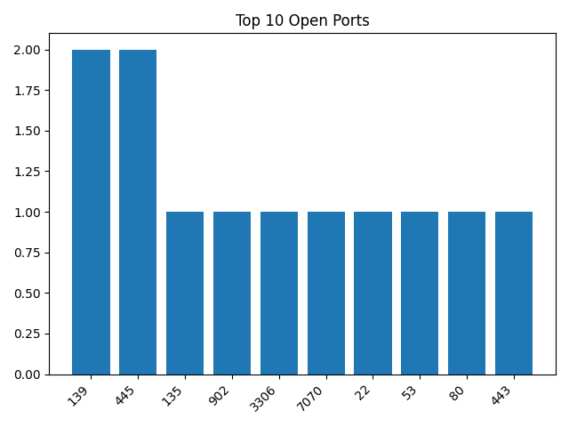
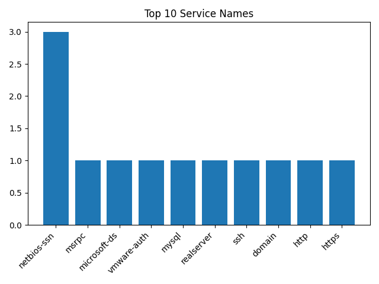
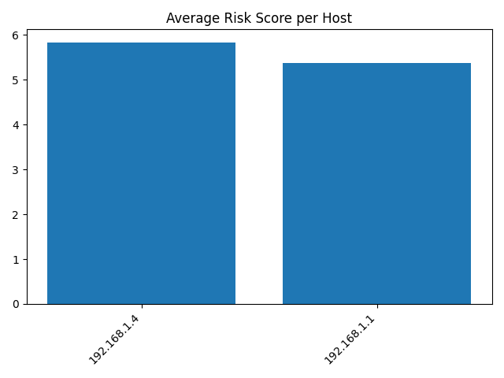

# Network Discovery Raporu

- Oluşturulma zamanı: **2026-01-12 03:41**
- Toplam host (scan çıktılarına göre): **2**
- Toplam açık servis kaydı: **14**
- Toplam bulgu (finding): **14**
- Ortalama risk skoru: **5.57/10**
- En yüksek tekil bulgu skoru: **7/10**
- En riskli host (ortalama): **192.168.1.4 (5.83/10)**

---

## Host: 192.168.1.1

- Açık port sayısı: **8**
- Host risk ortalaması: **5.38/10**

### Açık Portlar / Servisler

| Port | Proto | Servis | Ürün | Versiyon | Not |
|---:|:---:|---|---|---|---|
| 22 | tcp | ssh | Dropbear sshd | 2020.80 | protocol 2.0 |
| 53 | tcp | domain | dnsmasq | 2.85 |  |
| 80 | tcp | http |  |  |  |
| 139 | tcp | netbios-ssn | Samba smbd | 3.X - 4.X | workgroup: WORKGROUP |
| 443 | tcp | https |  |  |  |
| 445 | tcp | netbios-ssn | Samba smbd | 3.X - 4.X | workgroup: WORKGROUP |
| 1900 | tcp | upnp | Portable SDK for UPnP devices | 1.6.19 | Linux 4.4.115; UPnP 1.0 |
| 8080 | tcp | http-proxy |  |  |  |

### Bulgular (Findings)

**[7/10] UPnP servisi açık**  
- Port/Servis: `tcp/1900 upnp`  
- Neden: UPnP saldırı yüzeyini büyütebilir; yanlış yapılandırmada risk artar.  
- Öneri: Kullanmıyorsanız kapatın. Gerekliyse sadece LAN ile sınırlandırın.  

**[6/10] HTTP tabanlı arayüz/servis açık**  
- Port/Servis: `tcp/80 http`  
- Neden: Web arayüzleri varsayılan/zayıf parola ile riskli olabilir.  
- Öneri: Sadece LAN'dan erişim, güçlü parola, mümkünse HTTPS kullanın.  

**[6/10] SMB/NetBIOS (dosya paylaşımı) açık**  
- Port/Servis: `tcp/139 netbios-ssn`  
- Neden: LAN içinde yaygın ama saldırılarda sık hedef olur.  
- Öneri: Gereksizse kapatın. Gerekliyse paylaşım izinlerini daraltın, misafir erişimi kapatın.  

**[6/10] SMB/NetBIOS (dosya paylaşımı) açık**  
- Port/Servis: `tcp/445 netbios-ssn`  
- Neden: LAN içinde yaygın ama saldırılarda sık hedef olur.  
- Öneri: Gereksizse kapatın. Gerekliyse paylaşım izinlerini daraltın, misafir erişimi kapatın.  

**[6/10] HTTP tabanlı arayüz/servis açık**  
- Port/Servis: `tcp/8080 http-proxy`  
- Neden: Web arayüzleri varsayılan/zayıf parola ile riskli olabilir.  
- Öneri: Sadece LAN'dan erişim, güçlü parola, mümkünse HTTPS kullanın.  

**[5/10] SSH servisi açık**  
- Port/Servis: `tcp/22 ssh`  
- Neden: Brute-force denemelerine hedef olabilir.  
- Öneri: Gerekmiyorsa kapatın. Gerekiyorsa güçlü parola/anahtar ve IP kısıtı uygulayın.  

**[4/10] DNS servisi açık**  
- Port/Servis: `tcp/53 domain`  
- Neden: DNS genelde normaldir ama yanlış konfigürasyon (açık resolver) risk doğurabilir.  
- Öneri: DNS sadece LAN istemcilerine hizmet vermeli; dışarıya açık resolver olmamalı.  

**[3/10] HTTPS servisi açık**  
- Port/Servis: `tcp/443 https`  
- Neden: HTTPS iyi ama yine de yönetim arayüzü olabilir; hesap güvenliği önemli.  
- Öneri: Güçlü parola/2FA varsa açın, yönetimi LAN ile sınırlandırın.  

---

## Host: 192.168.1.4 (host.docker.internal)

- Açık port sayısı: **6**
- Host risk ortalaması: **5.83/10**

### Açık Portlar / Servisler

| Port | Proto | Servis | Ürün | Versiyon | Not |
|---:|:---:|---|---|---|---|
| 135 | tcp | msrpc | Microsoft Windows RPC |  |  |
| 139 | tcp | netbios-ssn | Microsoft Windows netbios-ssn |  |  |
| 445 | tcp | microsoft-ds |  |  |  |
| 902 | tcp | vmware-auth | VMware Authentication Daemon | 1.10 | Uses VNC, SOAP |
| 3306 | tcp | mysql | MySQL |  | unauthorized |
| 7070 | tcp | realserver |  |  |  |

### Bulgular (Findings)

**[7/10] MySQL portu açık**  
- Port/Servis: `tcp/3306 mysql`  
- Neden: DB portu açık olunca brute-force ve zafiyet taramalarına hedef olur.  
- Öneri: Sadece gereken IP'lere izin verin (firewall/bind). Güçlü parola ve güncel sürüm.  

**[6/10] SMB/NetBIOS (dosya paylaşımı) açık**  
- Port/Servis: `tcp/139 netbios-ssn`  
- Neden: LAN içinde yaygın ama saldırılarda sık hedef olur.  
- Öneri: Gereksizse kapatın. Gerekliyse paylaşım izinlerini daraltın, misafir erişimi kapatın.  

**[6/10] SMB/NetBIOS (dosya paylaşımı) açık**  
- Port/Servis: `tcp/445 microsoft-ds`  
- Neden: LAN içinde yaygın ama saldırılarda sık hedef olur.  
- Öneri: Gereksizse kapatın. Gerekliyse paylaşım izinlerini daraltın, misafir erişimi kapatın.  

**[6/10] VMware Authentication servisi açık**  
- Port/Servis: `tcp/902 vmware-auth`  
- Neden: Sanallaştırma/management servisleri hedef olabilir.  
- Öneri: Gereksizse kapatın; gerekliyse sadece lokal/izinli IP'lere kısıtlayın.  

**[5/10] Windows RPC (135) açık**  
- Port/Servis: `tcp/135 msrpc`  
- Neden: RPC normal olabilir ama ağ içi keşif/istismar zincirlerinde hedef olabilir.  
- Öneri: Gerekmiyorsa firewall ile kısıtlayın.  

**[5/10] 7070 üzerinde TLS/SSL servis açık (servis belirsiz)**  
- Port/Servis: `tcp/7070 realserver`  
- Neden: Servis net değilse yanlış yapılandırma/unutulmuş servis riski olabilir.  
- Öneri: Bu portu hangi uygulamanın açtığını doğrulayın; gereksizse kapatın.  

## Grafikler

---

